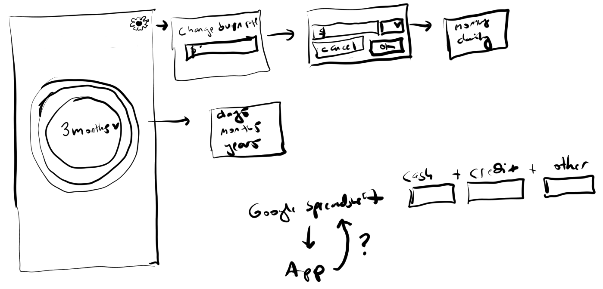

### Background thoughts
Generally the math is pretty simple, do you have your monthly expenses * whatever months in cash/savings/credit/assets to sell/etc...
I have a lot of crappy credit cards and so I have to login to all of them to tally up what they have. I'm aware you could automate that in different ways but this is something I do once to twice or more a month... which arguably is a waste of time takes me at least 5 minutes to do all of them.
Mainly the issue is the random small charges that get put on eg. $4/mo or whatever some cards have... and it's like if I miss that despite having a 0 balance can be bad.

### Design
The main design is just a concentric view that's colored. I've actually [already built something](https://github.com/jdc-cunningham/micro-projects/tree/master/money-state) like this for another app regarding the concentric view, I just like this presentation. Although since this one is mobile-first I may not do a hover approach and go with a cycled thing that highlights each ring and changes the value. So the most inner circle wills how a lower number than an outer circle(cumulative).

I'm still not quite sure if it's going to write to the Spreadsheet. One other aspect is increasing/decreasing your bills(which would be in another tab) and it would update the burn rate here.

### Progress Updates

#### 12/16/2020
Today I'm just trying to get a basic version of this app deployed to my phone. It will be a PWA. Since I don't want to keep buying domains/setting up SSLs(use certbot) I'm just going to make all of my microapps into one. That's why this app is being developed like a "component" ha... (crickets)

Anyway, I primarily was trying to write this with obscurity at first but realized would be better to just call it straight up eg. Net Worth/Bills tab.

I'm not supposed to spend too much time on this app right now because I have other things lined up/gotta get done today. But I need this, I need this to feel like I achieved something for myself on the weekend.

Oh man... running low on time here, I added a credit card tab and that took a bit to hunt down all the statements and fill it in, not needed now but useful for later

I'm done for now, I can feel my brain shitting the bed already so early, still riding that energy drink/fast "high" but gotta work on something else, thankfully nothing to difficult.

Currently it's functional within the scope of my own data eg. it outputs how many months I can pay my bare min bills.