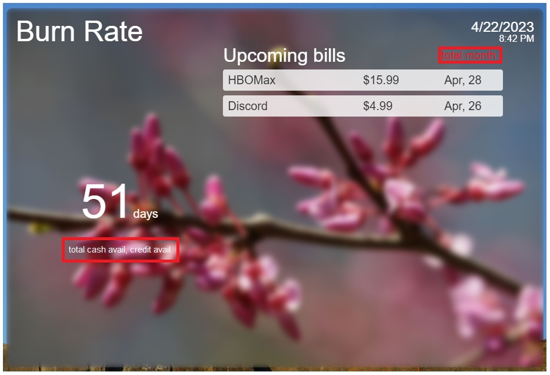

04/22/2023

8:43 PM (yeah... I just woke up like 30 mins ago)

Anyway I realized this app doesn't really capture what I wanted it to do.

Which is to remind me how f'd I am and how little money I have left.

So I'm going to add the total bills for the month and what I have left cash/credit wise.

I have all that data, just need to compute and add to the UI.

9:00 PM alright starting

these are the changes

this won't take me long... I am feeling the urge to do something

I need to get the ml-hat-cam to record video to usb

Generally study, get better at writing code, maybe read some books

9:32 PM

ehh... text readability could use work, I did add a darken layer over the blurred image

it'll be interesting to see this next month when there are many bills

let me just double check these numbers

yeap they are correct nice

11:05 PM

ugh... the clock is falling behind wth
